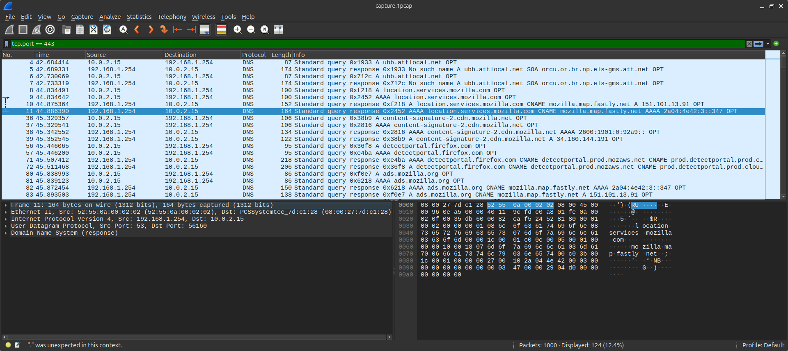

# Network Traffic Analysis Lab

## Overview
This project demonstrates network traffic analysis using tcpdump and Wireshark to capture, filter, and investigate home network traffic.

## Tools Used
- tcpdump (packet capture)
- Wireshark (packet analysis)
- nslookup (DNS lookups)
- whois (IP ownership identification)

## What I Did

### 1. Traffic Capture
Captured 1000 packets of network traffic using tcpdump:
```bash
sudo tcpdump -i enp0s3 -w capture1.pcap -c 1000
```

### 2. Analysis Process

**DNS Traffic Analysis:**
- Filtered for DNS queries to identify what domains my computer contacted
- Discovered connections to Google, Mozilla location services, AT&T infrastructure, and third-party tracking (TurboTax/Intuit)
- Identified that websites contact multiple supporting services beyond the main domain


**HTTPS Traffic Investigation:**
- Filtered encrypted traffic on port 443
- Identified connection to IP 151.101.13.91
- Used `whois` lookup to determine it belongs to Fastly CDN
- Confirmed traffic was legitimate content delivery, not malicious



## Key Findings
1. Web browsing generates traffic to many more domains than just the site you visit (ads, tracking, CDNs, fonts, etc.)
2. DNS queries happen in bursts as pages load and discover dependencies
3. Third-party tracking is pervasive - saw Intuit/TurboTax connections despite not visiting tax-related sites
4. Reverse DNS and whois lookups are essential for validating whether connections are legitimate

## Skills Demonstrated
- Packet capture with tcpdump
- Traffic filtering and analysis in Wireshark
- DNS query investigation
- Reverse DNS lookups
- IP ownership verification with whois
- Distinguishing normal traffic from potential threats
